# MSX-Templates-for-VisualStudio
## MSX Application Template Pack for MS Visual Studio (and other environments)

### Version 00.07.00 - Codename Venus

Aug 11th, 2026 
Damned Angel / 2020-2026

---

## Table of contents
- [MSX-Templates-for-VisualStudio](#msx-templates-for-visualstudio)
	- [MSX Application Template Pack for MS Visual Studio (and other environments)](#msx-application-template-pack-for-ms-visual-studio-and-other-environments)
		- [Version 00.07.00 - Codename Venus](#version-000700---codename-venus)
	- [Table of contents](#table-of-contents)
	- [Introduction](#introduction)
	- [To Caesar what is Caesar's](#to-caesar-what-is-caesars)
		- [Or: My note of acknowledgement and thanks](#or-my-note-of-acknowledgement-and-thanks)
	- [Where to get the templates](#where-to-get-the-templates)
	- [I don’t like/have/care for/use MS Visual Studio](#i-dont-likehavecare-foruse-ms-visual-studio)
	- [Starting a project](#starting-a-project)
		- [Setting up the environment](#setting-up-the-environment)
		- [Creating your MSX project in Visual Studio](#creating-your-msx-project-in-visual-studio)
		- [Creating your MSX project WITHOUT Visual Studio](#creating-your-msx-project-without-visual-studio)
		- [Building (compiling/assembling) your MSX application in Visual Studio](#building-compilingassembling-your-msx-application-in-visual-studio)
		- [Building (compiling/assembling) your MSX application WITHOUT Visual Studio](#building-compilingassembling-your-msx-application-without-visual-studio)
	- [Running your MSX applications on emulators](#running-your-msx-applications-on-emulators)
		- [Running your BIN program in WebMSX](#running-your-bin-program-in-webmsx)
		- [Running your BIN program in OpenMSX](#running-your-bin-program-in-openmsx)
		- [Running your ROM program in WebMSX](#running-your-rom-program-in-webmsx)
		- [Running your ROM program in OpenMSX](#running-your-rom-program-in-openmsx)
		- [Running your standard MSX-DOS program in WebMSX](#running-your-standard-msx-dos-program-in-webmsx)
		- [Running your standard MSX-DOS program in OpenMSX](#running-your-standard-msx-dos-program-in-openmsx)
		- [Running your MSX-DOS program with overlays in WebMSX](#running-your-msx-dos-program-with-overlays-in-webmsx)
		- [Running your MSX-DOS program with overlays in OpenMSX](#running-your-msx-dos-program-with-overlays-in-openmsx)
	- [Understanding the templates' files](#understanding-the-templates-files)
		- [Config files common to all templates](#config-files-common-to-all-templates)
			- [ApplicationSettings.txt](#applicationsettingstxt)
			- [ApplicationSources.txt](#applicationsourcestxt)
			- [LibrarySources.txt](#librarysourcestxt)
			- [Libraries.txt](#librariestxt)
			- [IncludeDirectories.txt](#includedirectoriestxt)
			- [BuildEvents.txt](#buildeventstxt)
			- [Symbols.txt](#symbolstxt)
			- [TargetConfig\_Debug.txt / TargetConfig\_Release.txt](#targetconfig_debugtxt--targetconfig_releasetxt)
		- [The ZOO object-orientation framework](#the-zoo-object-orientation-framework)
		- [AlchemiaZ debug symbols (ADB\_SUPPORT)](#alchemiaz-debug-symbols-adb_support)
		- [MSX BIN Application specific settings](#msx-bin-application-specific-settings)
		- [MSX ROM Application specific settings](#msx-rom-application-specific-settings)
		- [MSX-DOS Application specific settings](#msx-dos-application-specific-settings)
		- [MSX-DOS Overlay (MDO) specific settings and MDOSettings.txt](#msx-dos-overlay-mdo-specific-settings-and-mdosettingstxt)
		- [Advanced: crt0 memory layout and the `_POSTHEAP` area](#advanced-crt0-memory-layout-and-the-_postheap-area)

---

## Introduction
This asset is intended to document information about Damned Angel’s MSX Templates for MS Visual Studio (and other
environments).

4 templates are available:
- **MSX BIN applications** (BLOADable binary) ;
- **MSX ROM applications**;
- **MSX-DOS applications**; and
- **MSX-DOS application Overlays** (MDOs).

Each of the templates above has 2 variants:
- The Visual Studio one (\*.Template.zip), which allows VS to instantiate a project with build commands already
configured;
- The generic one (\*.Application.zip), which is a raw functional project, to be unzipped and edited with your
favorite IDE. Build commands must be issued in command-line (Windows, Linux and MacOS), or configured manually in your IDE.

**MSX-wise, the variants are equal and provide the same functionality.**

---

## To Caesar what is Caesar's
### Or: My note of acknowledgement and thanks
All the work I have been putting into the construction of the templates have been HEAVILY and COMPLETELY influenced by
[Konamiman](https://www.konamiman.com/msx/msx-e.html)'s work on
[SDCC libraries](https://www.konamiman.com/msx/msx-e.html#sdcc) and by
[Avelino Herrera](http://avelinoherrera.com/blog/)’s
[SDCC backend for MSXDOS](http://msx.avelinoherrera.com/index_en.html#sdccmsxdos) and SDCC
[backend for MSX ROMs](http://msx.avelinoherrera.com/index_en.html#sdccmsx).

Without their work, the MSX VS templates and makefiles I developed would not be there.

Masters, thank you very much for pioneering and publishing the content on MSX file formats generation.

In the current version of the templates, the build script has been unified in a single python file, supporting Windows, Linux and MacOS. Originally, however, there was a BAT script for Windows and a port for bash (Linux and MacOS) by [Pedro de Medeiros](https://github.com/pvmm).

Moreover, Pedro has been also a valuable critic, supporter, beta tester and technical orientator. In other words, a real friend!

Pedro, you have my eternal gratitude for your interest, ideas, patience and willful caring for the templates and build script.

Additionally, I want to thank everbody on the WhatsApp **"MSX Pascal, C, ASM etc."** group, which are too many to cite
individually, but who helped a lot analyzing bugs and finding solutions. Thank you all!

---

## Where to get the templates
Please access the project's [Github](https://github.com/DamnedAngel/MSX-Templates-for-VisualStudio/releases) to get the
latest version of the templates.

After reading the release notes, go down to the Asset section of the page and you will find the templates and their
variants.

---

## I don’t like/have/care for/use MS Visual Studio
If you don’t use MS VIsual Studio but still want to use the MSX project templates, you are lucky.

Although the templates are conceptualized and developed inside Microsoft Visual Studio, their bindings to this
environment are fairly loose. Surely, the VS-Specific templates (\*.Template.zip) include specific files that define
Visual Studio solutions and projects, but one can thoroughly disregard them and still take advantage of the project
structure and build script, along with his/her preferred IDE/Editors. In fact, a raw version of the templates
(\*.Application.zip) is readily provided for your convenience.

To use the templates outside Visual Studio (Windows, Linux, MacOS):
1. Make sure to have Python, SDCC and Hex2Bin installed in the path of your OS.
1. Download the raw template (\*.Application.zip) and unzip it in an appropriate folder in you computer.
1. Take advantage of the project structure.
1. Use the configuration files as described in this manual.
1. Build your project:
	1. Open a console of your Operating System (run **"CMD"** on Windows).
	1. Go to your project’s folder with the **“cd”** command.
	1. Enter one of the following commands (replace **\<PROFILE\>
	** with **“Debug”** or **“Release”** (case sensitive)):
	1. Windows (backslash):

        	Build:			python .\Make\make.py <PROFILE>
            Rebuild All:          	python .\Make\make.py <PROFILE> clean all
    		Clean:			python .\Make\make.py <PROFILE> clean
	1. Linux/Mac (slash):

			Build:			python ./Make/make.py <PROFILE>
			Rebuild All: 		python ./Make/make.py <PROFILE> clean all
			Clean:			python ./Make/make.py <PROFILE> clean
	1. `Build` recompiles only new or changed sources; use `Rebuild All` to force a full recompile.
1. Have FUN!

---

## Starting a project
### Setting up the environment
1. Download and install your preferred IDE/Code editor.
    1. In case you wish to use MS Visual Studio, download it from https://visualstudio.microsoft.com/downloads/. The
free "Community" version is good enough. **Be sure to install some workload, preferably the support for C++ and/or
C++ games. Such extensions are NOT used for building the MSX programs, but they seem to be necessary in order for
VS to recognize the MSX project templates.**
1. Download and install SDCC (version 4.2.0 or newer) from http://sdcc.sourceforge.net/.
    1. You may need to recompile from the source if the binary distribution for your OS is not available. It is a
straightforward process, though.
    1. Make sure you have sdcc.exe and sdasz80.exe (comes with SDCC) in your OS’s path variable (open a command
prompt/terminal/shell and type **sdcc \<ENTER\>	** and **sdasz80 \<ENTER\>** and be sure the programs are executed).
1. Download and install Hex2Bin from http://hex2bin.sourceforge.net/.
	1. Again, you may need to recompile from the source if the binary distribution for your OS is not available. It is
also a very straightforward process.
	1. Make sure you have hex2bin.exe in your Windows path variable (open a prompt/terminal/shell and type **hex2bin
\<ENTER\>** and be sure the programs are executed).
1. Install Python from https://www.python.org/.
    1. In MacOS, the Python installer may create a python alias for the command line operation, but python scripts
cannot make use of such aliases. So, if you are on Mac, create a symbolic link to your python binary:

			ln -s /usr/local/bin/python /usr/local/bin/python3.12
    	Replace the last term in the line above with the proper version of the python binary installed.

1. Download the MSX Application Templates from the project's
[Github](https://github.com/DamnedAngel/MSX-Templates-for-VisualStudio/releases).
    1. If you are using Visual Studio:
    	1. Download the the Visual Studio templates (**\*.Template.zip**).
		1. Open Windows Explorer and go to **C:\\Users\\[User Name]\\Documents\\Visual Studio
			[Version]\\Templates\ProjectTemplates\\** (create the folders, if needed).
		1. Copy/Move the MSX Application Templates zip files to this folder:

			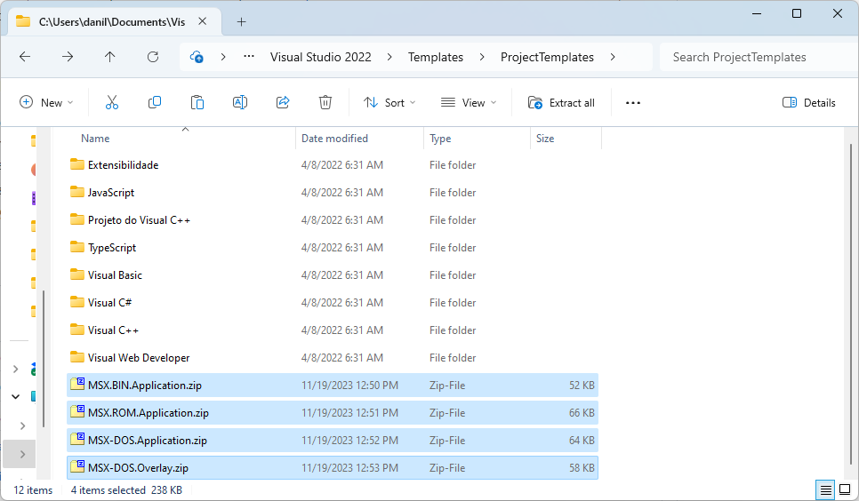
		1. That should be all. In some installations, however, VS is stubborn to recognize the templates. If you
encounter such a problem, things you may try:
			1. Create a new folder under “ProjectTemplates” and name it "MSX". Put the templates there.
			1. Unzip the templates, each in their own separate folder.
			1. If you installed VS without any workload (Language support), try to install C/C++ workloads
	1. If you are **NOT** using Visual Studio:
		1. Download the raw templates (**\*.Application.zip**). These should be unzipped in your development folder every
time you want to create a new project.
		1. Have a beer.

### Creating your MSX project in Visual Studio
1. After installing the templates, fire MS Visual Studio up.
1. Click the **Create a new project** button:

    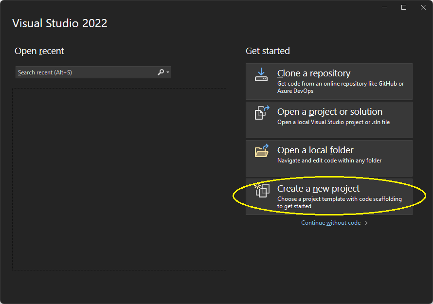
1. Locate the MSX templates on the template list. Sometimes their are shown in the bottom of the list, so you
may have to scroll down:

    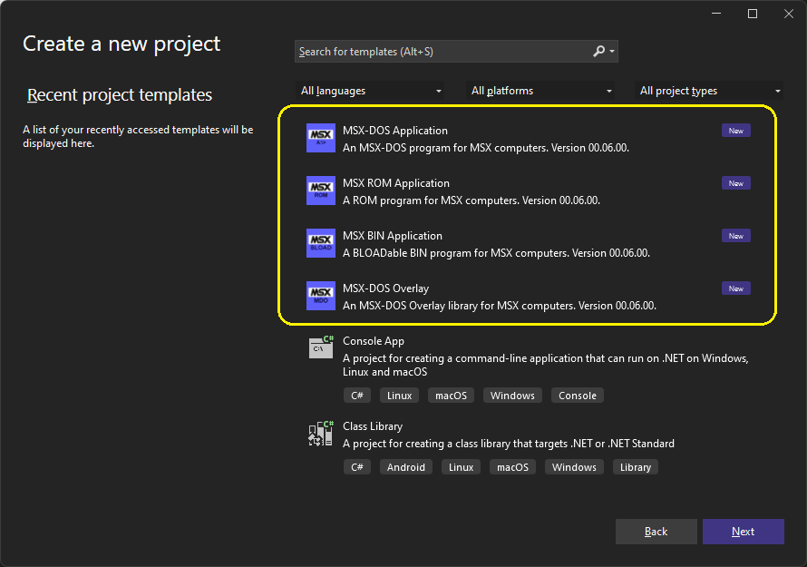
1. Choose the template you want and click **Next**.
1. Fill in the name of your solution and project and set your preferred location for the project files:

    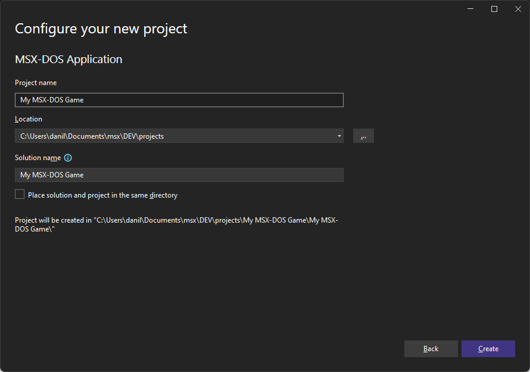
1. At this point, VS will double your project name as the Solution Name. If you don’t intend to have multiple
projects inside the solution, leave it that way.
1. Leave the **Place solution and project in the same directory** checkbox unmarked.
1. Click the **Create** button.
1. Sit and relax. When the fairies of the 8-bit realms complete their job, you should see the lovable Visual
Studio Project Screen, inviting you to rock and roll:

	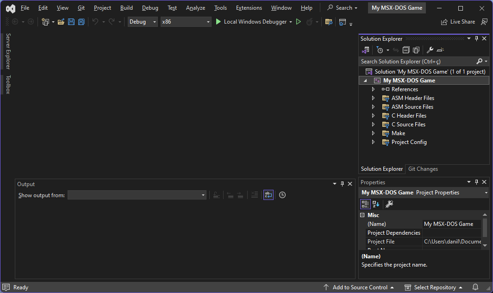
1. Congrats! You have an MSX Application project. Have another beer.

### Creating your MSX project WITHOUT Visual Studio
1. After downloading the appropriate raw template (**\*.Application.zip**), create a folder for your project and unzip
the template into it.
1. Open the project files in the IDE of your choice.
1. Congrats! You have an MSX Application project. Have another beer.

### Building (compiling/assembling) your MSX application in Visual Studio
1. Select the configuration you want to use for the compiling/assembling:

	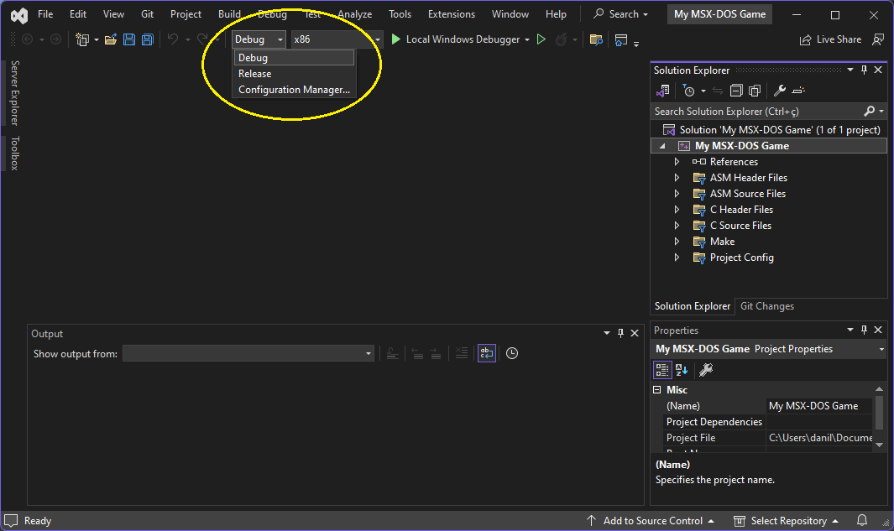
**Note:** Later in this document we will (eventually) discuss what this option is for. For the moment, choose
whatever you like, there will be no difference.
1. Select **Build | Build Solution** menu option:

	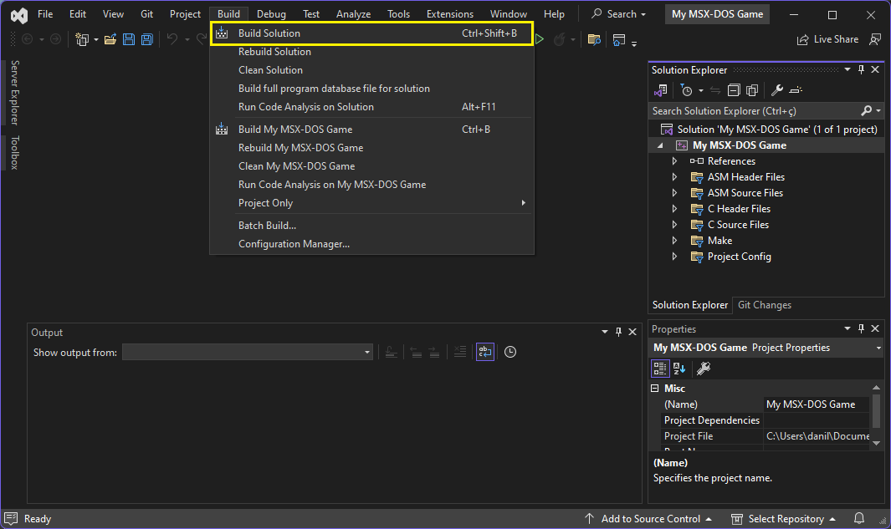
1. Visual Studio will run the make script. When it ends, you should see the results of the build process and the
messages of success in the bottom **Output** panel:

	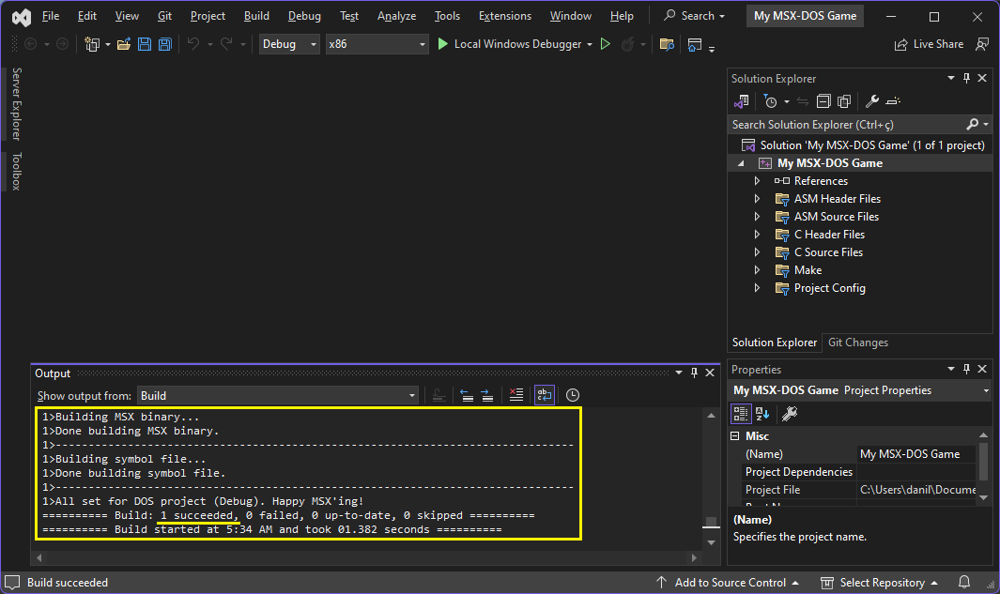
1. Inspect your generated binary file:
1. Open Windows Explorer and navigate to the directory holding your solution (the folder you defined in step 2.iv
of [Creating your MSX project in Visual Studio](#creating-your-msx-project-in-visual-studio) section above.
1. Access your solution’s folder.
1. Access your project’s folder.
1. Access the directory of your chosen build configuration (Debug/Release - see step 1 above).
1. Access the "bin" folder. Your program should be there (the extension of the file may vary according to the type
of project you chose):

	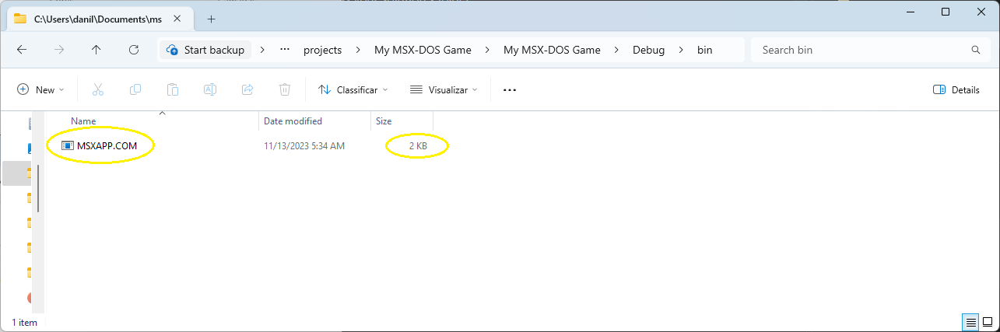
1. Yey! You successfully built your MSX application! Have one more beer!

### Building (compiling/assembling) your MSX application WITHOUT Visual Studio
1. Open a console of your Operating System (run **"CMD"** on Windows).
1. Go to your project’s folder:
1. Windows:

	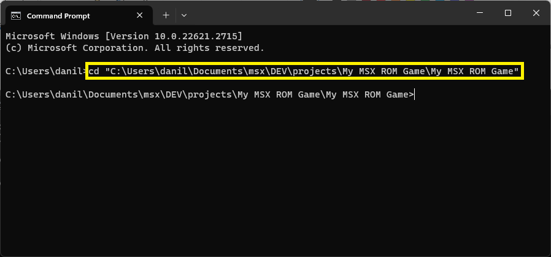
1. Linux/Mac:

	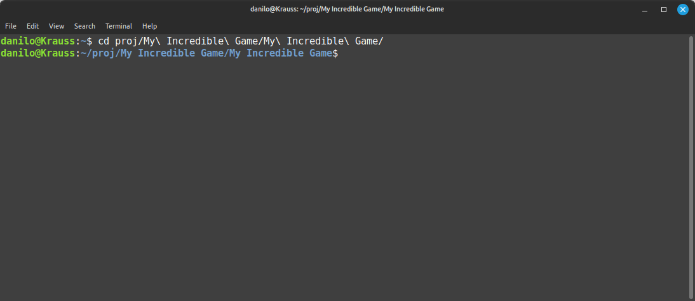
1. Enter one of the following commands (replace **\<PROFILE\>
** with **“Debug”** or **“Release”** (case sensitive)):
    1. Windows (backslash):

        	Build:			python .\Make\make.py <PROFILE>
        	Rebuild All: 		python .\Make\make.py <PROFILE> clean all
        	Clean:			python .\Make\make.py <PROFILE> clean

    	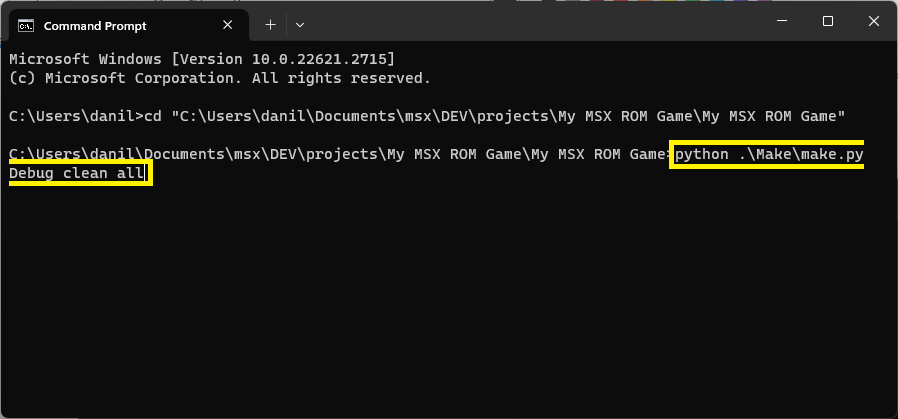
    1. Linux/Mac (slash):

        	Build:			python ./Make/make.py <PROFILE>
        	Rebuild All: 		python ./Make/make.py <PROFILE> clean all
        	Clean:			python ./Make/make.py <PROFILE> clean

    	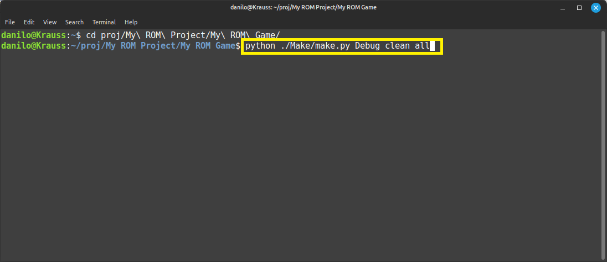
1. `Build` is incremental: only source files that are new or have changed since the last build are recompiled;
unchanged files are linked from their existing `.rel` objects. Use `Rebuild All` (`clean all`) when you want a
full recompile - for example after changing a header, a compiler flag or a `Config` setting.
1. When the script ends, you should see the results of the build process and the messages of success:
1. Windows:

	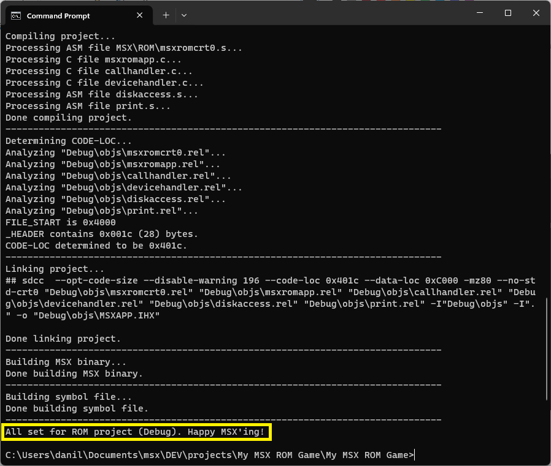
1. Linux/Mac:

	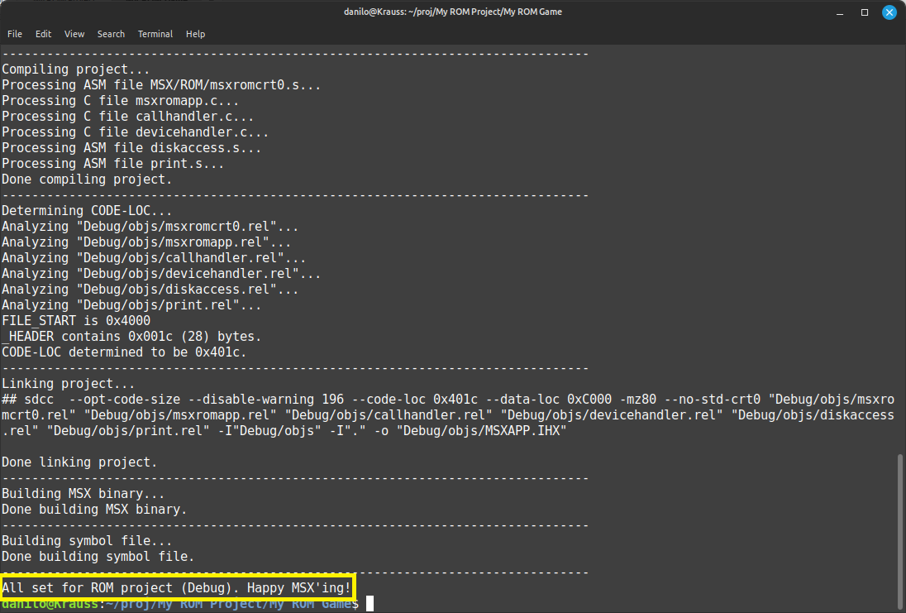
1. Inspect your generated binary file:
1. Windows:

	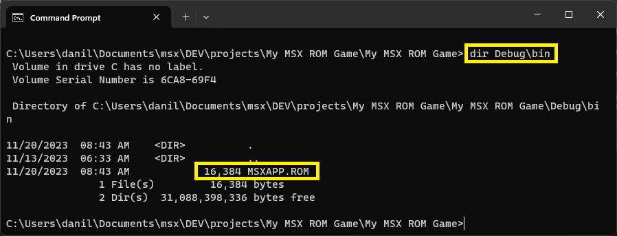
1. Linux/Mac:

	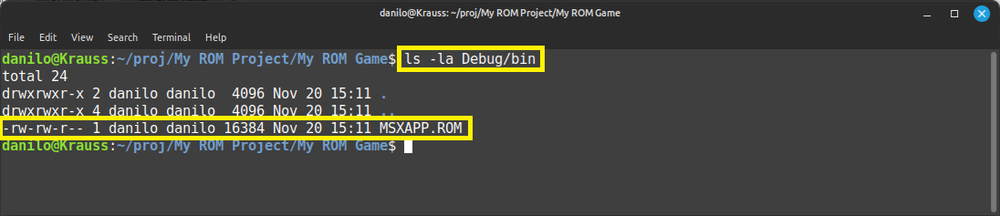
1. Yey! You successfully built your MSX application! Have one more beer!

---

## Running your MSX applications on emulators
The processes below suppose you have the emulators and its tools configured. If you don't, you will probably still be
able to use [WebMSX](https://webmsx.org/), which operation is very straight forward.

### Running your BIN program in WebMSX
1. Build your BIN project as instructed in the sections
[Building (compiling/assembling) your MSX Application in Visual Studio](#building-compilingassembling-your-msx-application-in-visual-studio)
or
[Building (compiling/assembling) your MSX Application WITHOUT Visual Studio](#building-compilingassembling-your-msx-application-without-visual-studio).
1. Fire WebMSX up and select **Drive A | Import Files to Disk** menu option:

	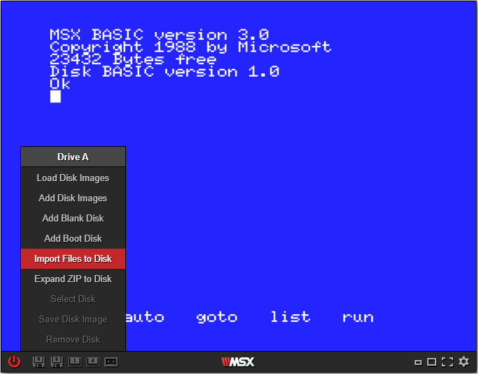
1. Select your program in the **Open File dialog** and click **Open**:

	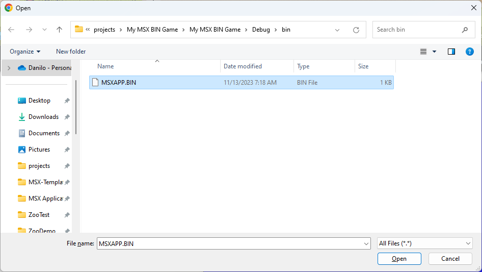
1. In MSX-BASIC, type the command **FILES \<ENTER\>
** to confirm that your program was added to the disk image:

	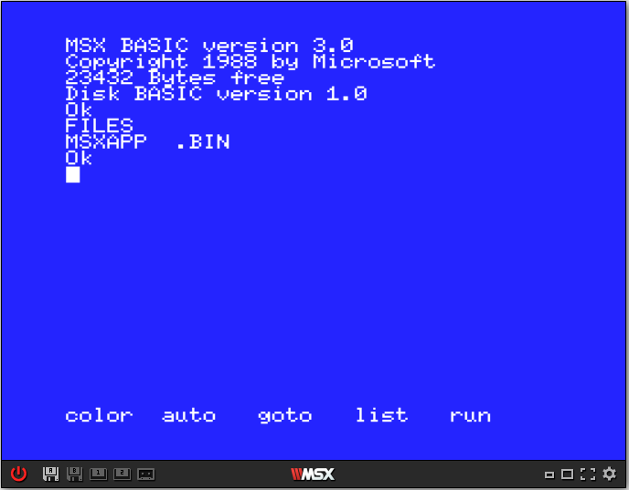
1. Now… the time of truth! The moment we all have been waiting for… Type **BLOAD “MSXAPP.BIN”, R \<ENTER\>** and you
should see you program blissfully running:

	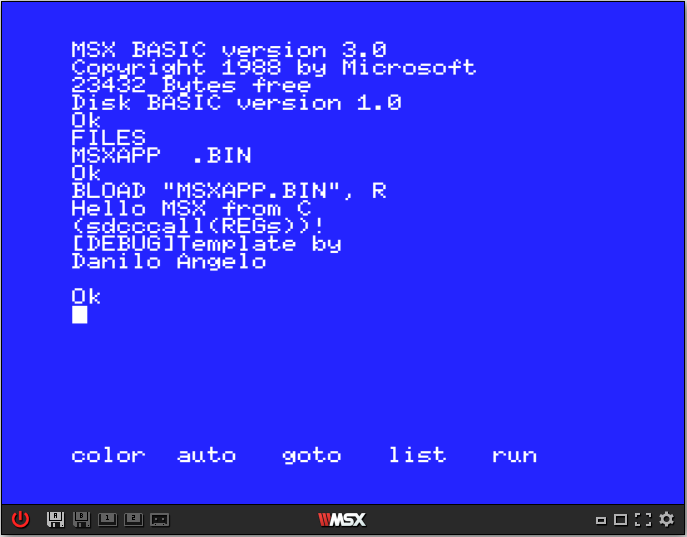
1. Yey! You successfully executed your MSX BIN application! Have one more beer!

### Running your BIN program in OpenMSX
1. Build your BIN project as instructed in the sections
[Building (compiling/assembling) your MSX Application in Visual Studio](#building-compilingassembling-your-msx-application-in-visual-studio)
or
[Building (compiling/assembling) your MSX Application WITHOUT Visual Studio](#building-compilingassembling-your-msx-application-without-visual-studio).
1. Fire OpenMSX's Catapult up, start the emulation and, in the **Session tab**, click on **Disk A** and select
**Browse for disk folder (DirAsDisk)** on the drop down menu:

	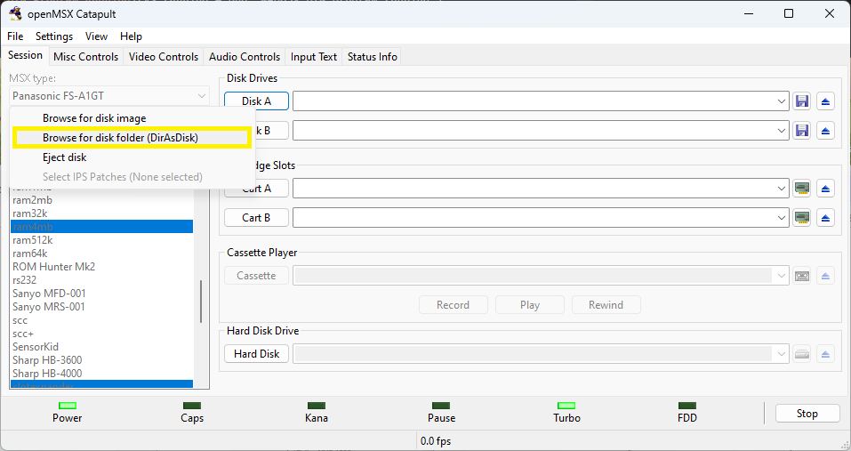
1. Select your program’s folder in the Browse for Folder dialog and click on the **Select Folder** button:

	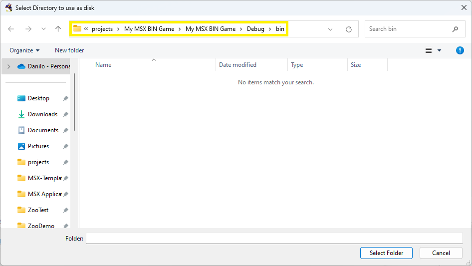
1. In MSX-BASIC, type the command **FILES \<ENTER\>** to confirm that your program was added to the disk image:

	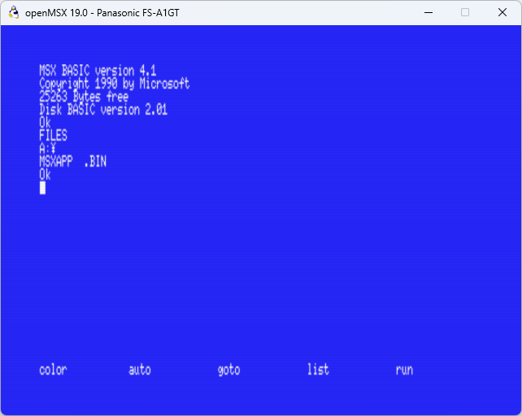

1. Now… the time of truth! The moment we all have been waiting for… Type **BLOAD “\<FLOPPY DRIVE\>:MSXAPP.BIN”, R
\<ENTER\>** and you should see you program blissfully running:

	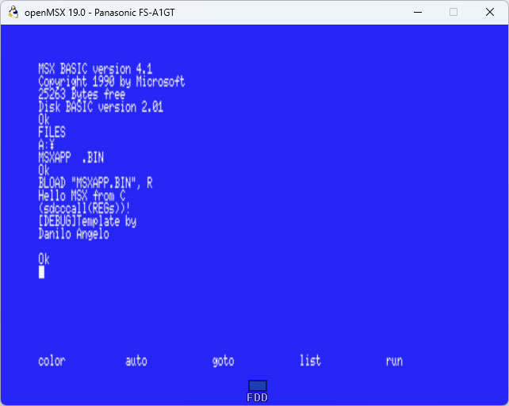

1. Yey! You successfully executed your MSX BIN application! Have one more beer!

### Running your ROM program in WebMSX
1. Build your ROM project as instructed in the sections
[Building (compiling/assembling) your MSX Application in Visual Studio](#building-compilingassembling-your-msx-application-in-visual-studio)
or
[Building (compiling/assembling) your MSX Application WITHOUT Visual Studio](#building-compilingassembling-your-msx-application-without-visual-studio).
1. Fire WebMSX up, drag the ROM file from your filesystem explorer and drop it on WebMSX's **Cartridge 1** panel:

	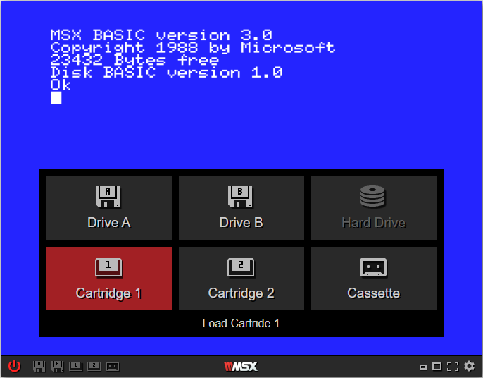
1. During the boot process, you will see a (very fast) flash with the messages from the cartridge (don't worry they are
repeated. That is an effect of the ROM mirroring feature of the emulator):

	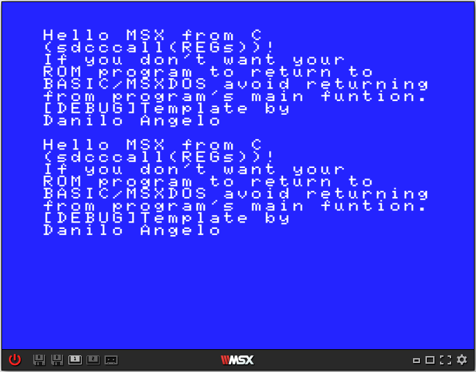
    **NOTE:** the messages are shown for just a brief moment because the example program just shows the messages and
quits. Your program may (and probably will) have a different behavior.
1. Since the example program in its original settings implements extensions to the CALL command in basic, you can also
test this feature after the boot, typing **CALL CMD1 ("Message") \<ENTER\>** and **CALL RUNCART \<ENTER\>**:

	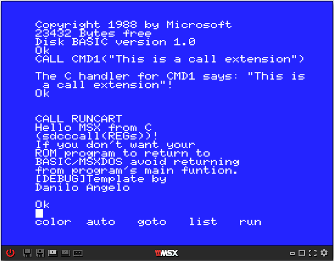
1. That's it! You successfully executed your MSX Cartridge ROM! One more beer for you!

### Running your ROM program in OpenMSX
1. Build your ROM project as instructed in the sections
[Building (compiling/assembling) your MSX Application in Visual Studio](#building-compilingassembling-your-msx-application-in-visual-studio)
or
[Building (compiling/assembling) your MSX Application WITHOUT Visual Studio](#building-compilingassembling-your-msx-application-without-visual-studio).
1. Run OpenMSX's Catapult. In the **Session** tab, click on **Cart A** and select **Browse ROM image** in the drop down
menu:

	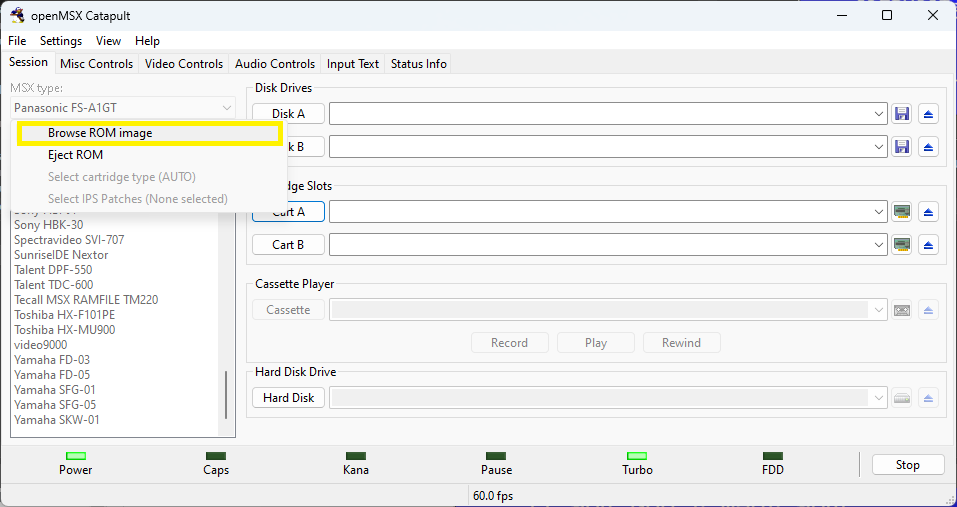
1. Select your ROM file in the **Select ROM image** dialog and click on the **Open** button:

	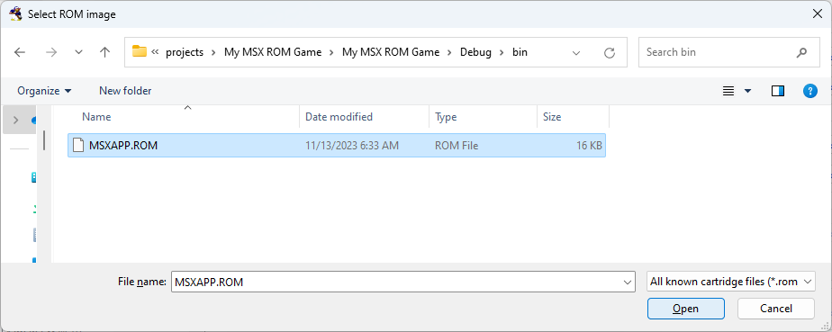
1. Back on Catapult's window, click on **Start** button on the bottom right:

	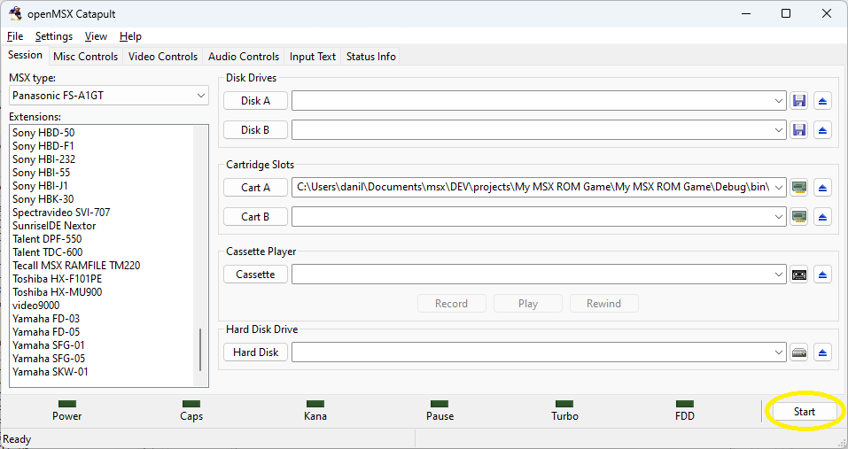
1. During the boot process, you will see a (very fast) flash with the messages from the cartridge (don't worry they
are repeated. That is an effect of the ROM mirroring feature of the emulator):

	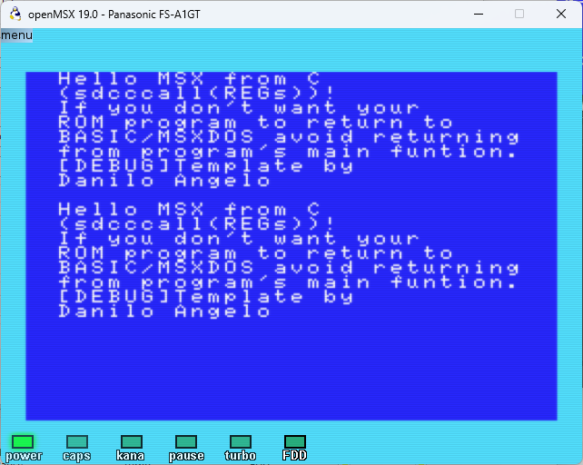
    **NOTE:** the messages are shown for just a brief moment because the example program just shows the messages and
quits. Your program may (and probably will) have a different behavior.
1. Since the example program in its original settings implements extensions to the CALL command in basic, you can also
test this feature after the boot, typing **CALL CMD1 ("Message") \<ENTER\>** and **CALL RUNCART \<ENTER\>**:

	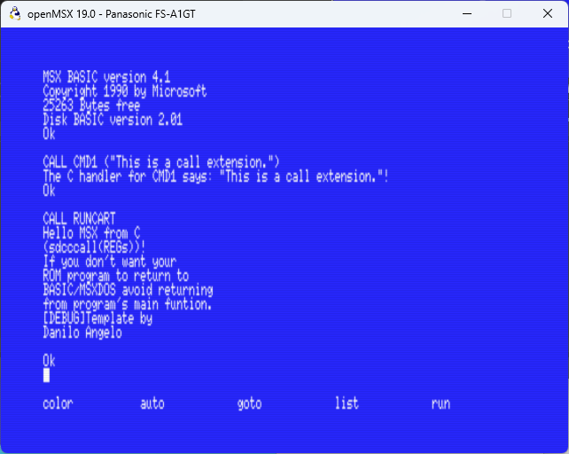
1. You made it! You successfully executed your MSX Cartridge ROM! One more beer for you!

### Running your standard MSX-DOS program in WebMSX
1. Make sure that the **MDO_SUPPORT** option in *ApplicationSettings.txt** is set to **_OFF**:

	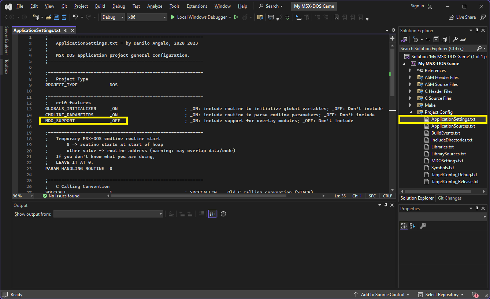
1. Build your MSX-DOS project as instructed in the sections
[Building (compiling/assembling) your MSX Application in Visual Studio](#building-compilingassembling-your-msx-application-in-visual-studio)
or
[Building (compiling/assembling) your MSX Application WITHOUT Visual Studio](#building-compilingassembling-your-msx-application-without-visual-studio).
1. Select WebMSX's **Drive A | Add Boot Disk** menu option:

	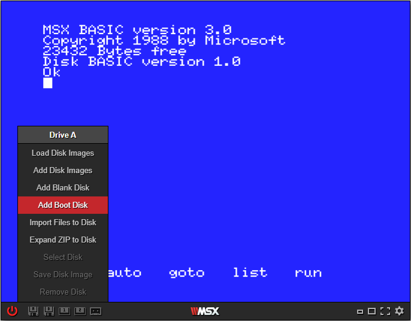
1. Select WebMSX's **Drive A | Import Files to Disk** menu option:

	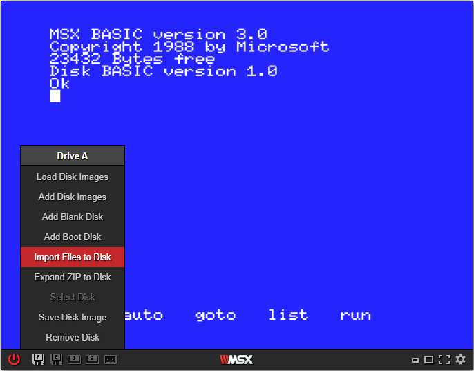
1. Navigate to your project's binary file folder, select your executable and click the **Open** button:

	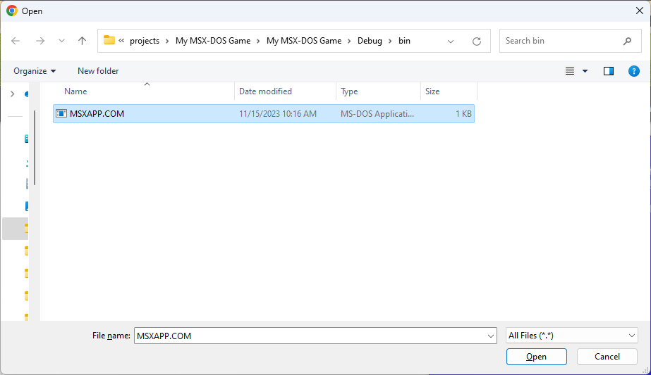
1. Now your floppy image is complete, with MSX-DOS and your executable. Reset WebMSX to boot into MSX-DOS by selecting
**System | Reset** menu option:

	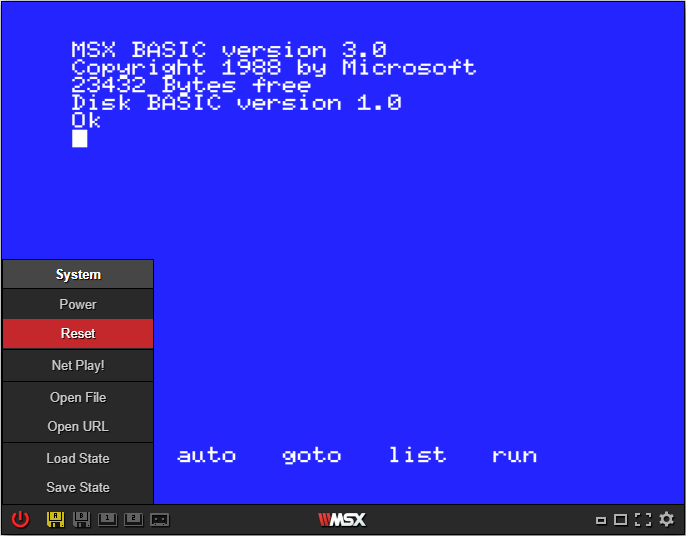
1. When MSX-DOS boot completes, issue the "**DIR \<ENTER\> **" command and confirm that your program is available to be
executed:

	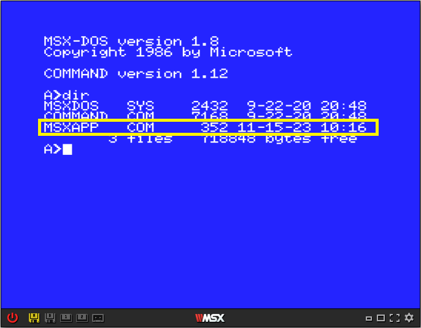
1. Execute your program by typing "**MSXAPP \<ENTER\>**":

	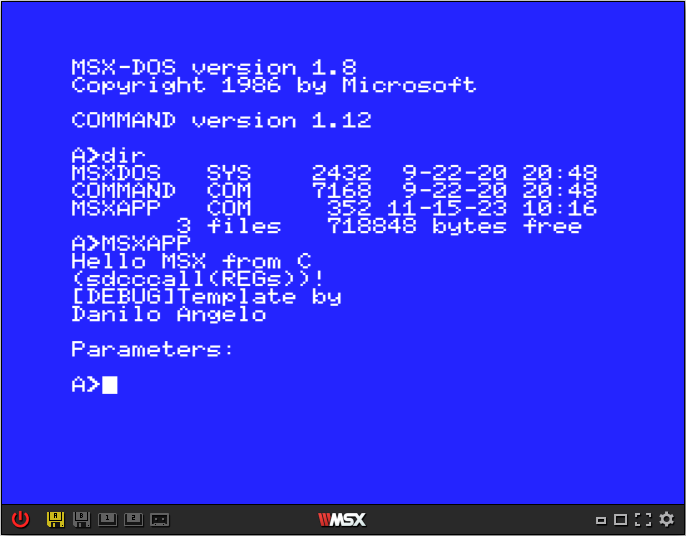
1. The MSX-DOS template parses command line parameters, controlled by the **MAX_CMDLINE_PARAMETERS** setting in
**ApplicationSettings.txt** (0 disables parsing; N reserves space for up to N parameters, N up to 63; default: 10).
Let's experiment with it. Type "**MSXAPP \<PARAMETERS\>\<ENTER\>**":

	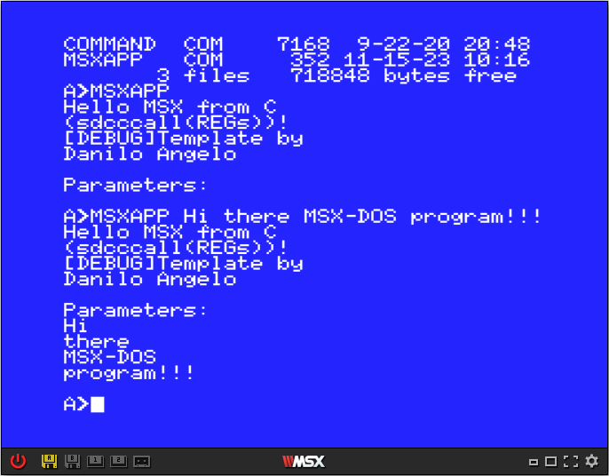
1. Congrats for having your MSX-DOS program run! Have one more beer!

### Running your standard MSX-DOS program in OpenMSX
1. Although our target is using OpenMSX, we will still use WebMSX to generate the floppy disk image. Run steps
1 through 7 of the previous section
([Running your standard MSX-DOS program in WebMSX](#running-your-standard-msx-dos-program-in-webmsx)).
1. Once you confirmed that the floppy disk image is correct in the previous steps, select WebMSX's
**Drive A | Save Disk Image** menu option and store the file somewhere in your computer.

	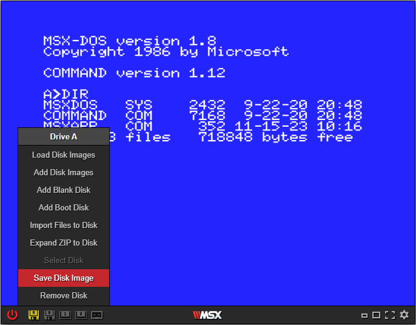
1. Fire OpenMSX's Catapult front-end up and choose an MSX model with floppy disk to be emulated. In the example below
1I chose Panasonic FS-A1GT (Turbo-R) because it is fast:

	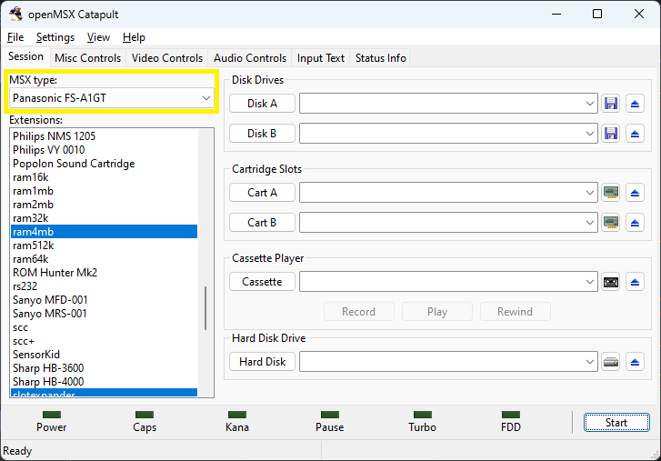
1. Click on **Disk A** button and select **Browse for disk image** menu option:

	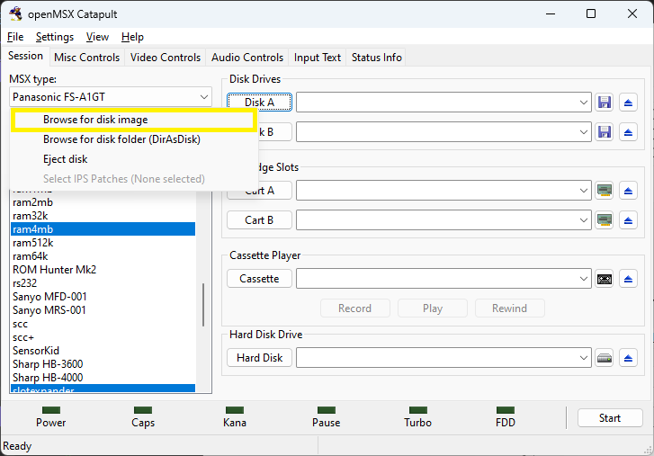
1. In the **Select disk image** dialog, navigate to the folder you saved the floppy image file. Select the image file
and click the **Open** button:

	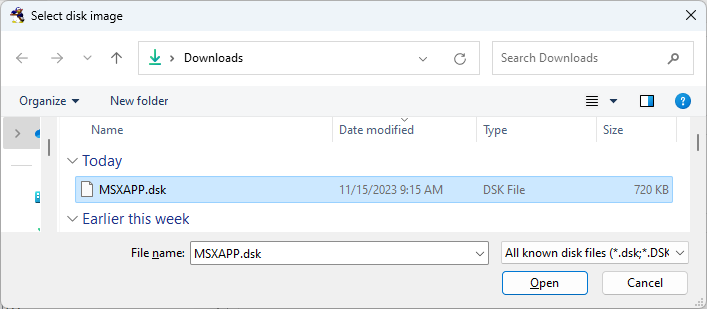
1. In Catapult's main window, click the **Start** button:

	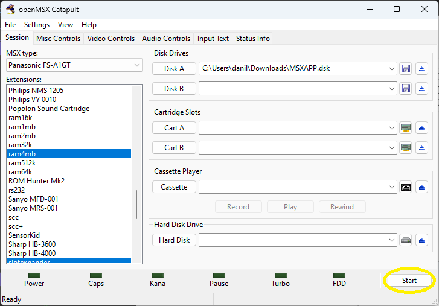
1. When MSX-DOS boot completes, issue the "**DIR \<ENTER\>**" command and confirm that your program is available to be
executed:

	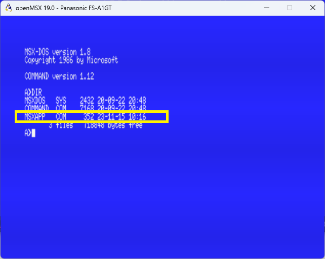
1. Execute your program by typing "**MSXAPP \<ENTER\>**":

	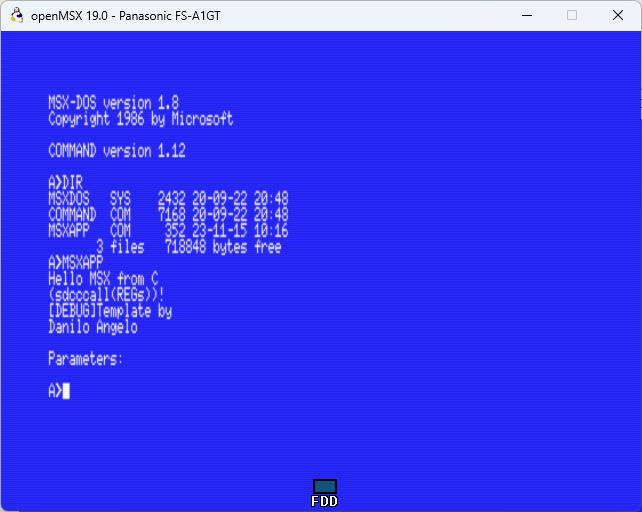
1. The MSX-DOS template parses command line parameters, controlled by the **MAX_CMDLINE_PARAMETERS** setting in
**ApplicationSettings.txt** (0 disables parsing; N reserves space for up to N parameters, N up to 63; default: 10).
Let's experiment with it. Type "**MSXAPP \<PARAMETERS\> \<ENTER\>**":

	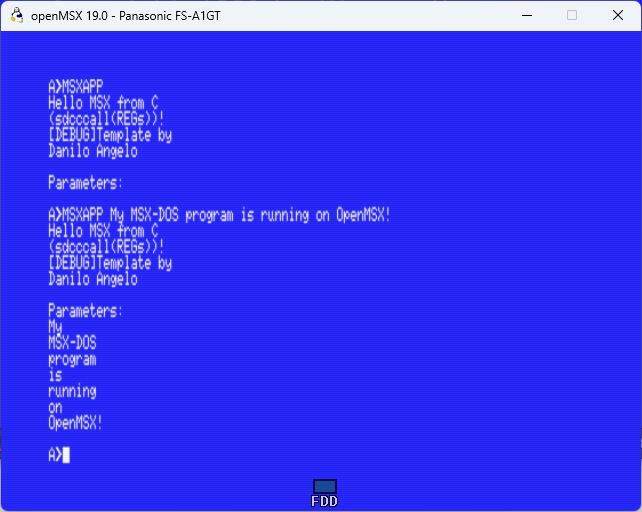
1. Congrats for succeeding running your MSX-DOS program! Have one more beer!

### Running your MSX-DOS program with overlays in WebMSX
1. In the MSX-DOS module of your project (the program itself, not the MDO (MSX-DOS Overlay) module yet), make sure
that the **MDO_SUPPORT** option in the **ApplicationSettings.txt** config file is set to **_ON**:

	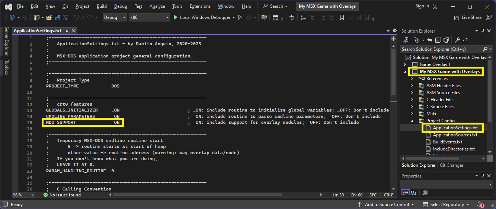
1. Build your MSX-DOS project module as instructed in the sections
[Building (compiling/assembling) your MSX Application in Visual Studio](#building-compilingassembling-your-msx-application-in-visual-studio)
or
[Building (compiling/assembling) your MSX Application WITHOUT Visual Studio](#building-compilingassembling-your-msx-application-without-visual-studio).
1. In the MDO module of your project, make sure that the **MSX_BIN_PATH** option in both **TargetConfig_Debug.txt** and
**TargetConfig_Release.txt** config files points to the main MSX-DOS application's bin folders, so that the build
process will automatically place the MDOs files with the COM executable file:

	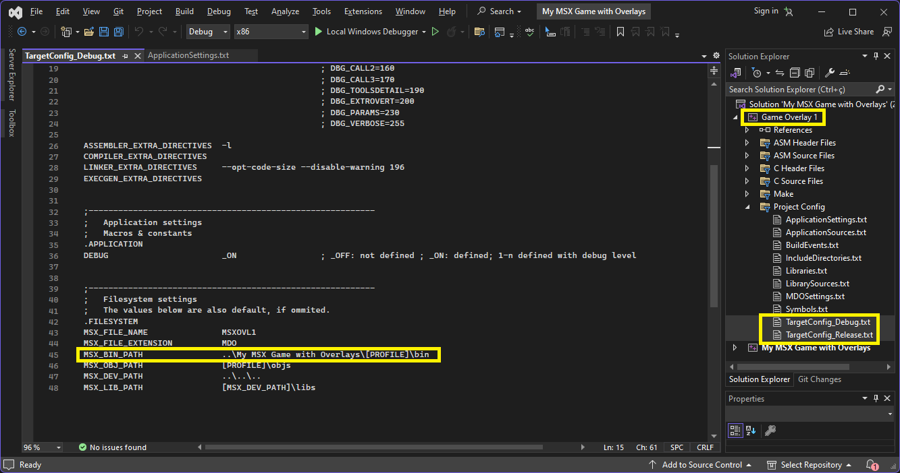
1. Still in the MDO module of your project, make sure that the **MDO_APPLICATION_PROJECT_PATH** and
**MDO_PARENT_PROJECT_PATH** variables in the **MDOSettings.txt** config file point to your main MSX-DOS module
project:

	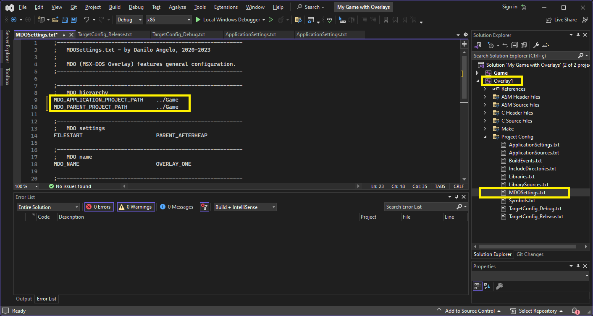

	**Note:** each MDO embeds its own load address, computed by the **FILESTART** setting in **MDOSettings.txt**.
	The default, **PARENT_AFTERHEAP**, places the MDO right after its parent's memory usage ends. If you are chaining
	several MDOs and want one to load after a *sibling* MDO instead of directly after the parent, set **FILESTART**
	to **PREVIOUS_AFTERHEAP** and point **MDO_PREVIOUS_PROJECT_PATH** to that sibling's project folder. A literal
	address is also accepted if you need to fix the load address manually.
1. Build your MDO module as instructed in the sections
[Building (compiling/assembling) your MSX Application in Visual Studio](#building-compilingassembling-your-msx-application-in-visual-studio)
or
[Building (compiling/assembling) your MSX Application WITHOUT Visual Studio](#building-compilingassembling-your-msx-application-without-visual-studio).
1. Select WebMSX's **Drive A | Add Boot Disk** menu option:

	
1. Select WebMSX's **Drive A | Import Files to Disk** menu option:

	
1. Navigate to your project's binary file folder, select your COM executable and your MDO library and click the **Open** button:

	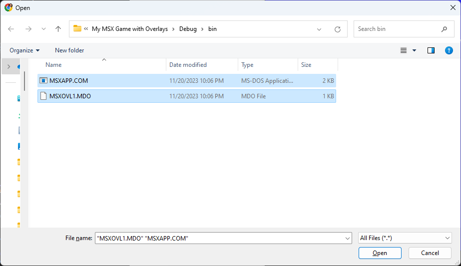
1. Now your floppy image is complete, with MSX-DOS and your executable. Reset WebMSX to boot into MSX-DOS by selecting
**System | Reset** menu option:

	
1. When MSX-DOS boot completes, issue the "**DIR \<ENTER\>**" command and confirm that your files are available to be
executed:

	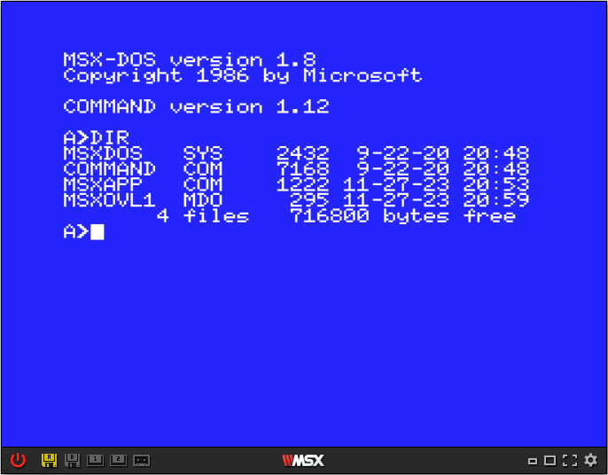
1. Optionally enter 80-column mode by typing "**MODE 80 \<ENTER\>**" (recommended) and execute your program by typing
1. "**MSXAPP \<ENTER\>**":

	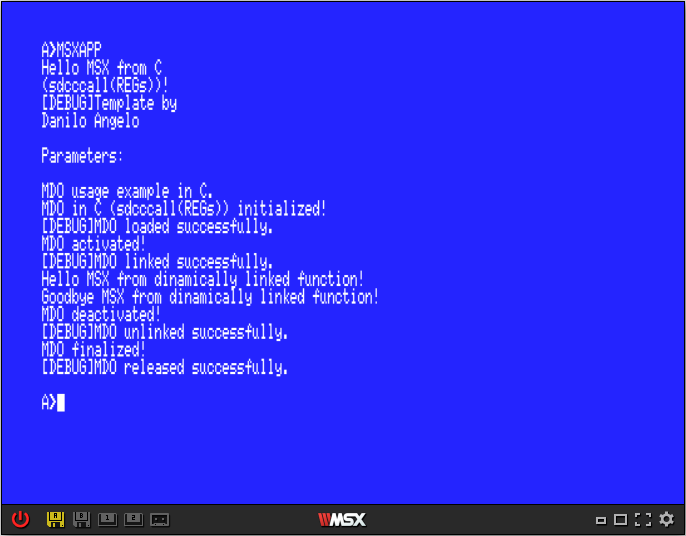
1. The MSX-DOS template parses command line parameters, controlled by the **MAX_CMDLINE_PARAMETERS** setting in
**ApplicationSettings.txt** (0 disables parsing; N reserves space for up to N parameters, N up to 63; default: 10).
Let's experiment with it. Type "**MSXAPP \<PARAMETERS\>\<ENTER\>**":

	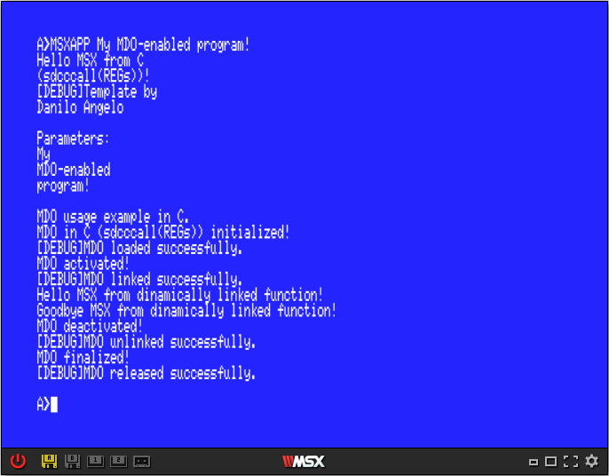
1. Congrats for having your MDO-enabled MSX-DOS program run! Have one more beer!

### Running your MSX-DOS program with overlays in OpenMSX
1. Although our target is using OpenMSX, we will still use WebMSX to generate the floppy disk image. Run steps
1 through 10 of the previous section
([Running your MSX-DOS program with overlays in WebMSX](#running-your-msx-dos-program-with-overlays-in-webmsx)).
1. Once you confirmed that the floppy disk image is correct in the previous steps, select WebMSX's
**Drive A | Save Disk Image** menu option and store the file somewhere in your computer.

	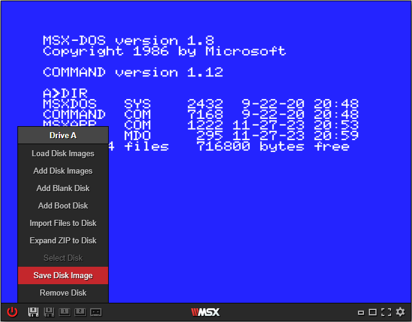
1. Fire OpenMSX's Catapult front-end up and choose an MSX model with floppy disk to be emulated. In the example below
I chose Panasonic FS-A1GT (Turbo-R) because it is fast:

	
1. Click on **Disk A** button and select **Browse for disk image** menu option:

	
1. In the **Select disk image** dialog, navigate to the folder you saved the floppy image file. Select the image file
and click the **Open** button:

	
1. In Catapult's main window, click the **Start** button:

	
1. When MSX-DOS boot completes, issue the "**DIR \<ENTER\>**" command and confirm that your program, along with the
MDO file, is available to be executed:

	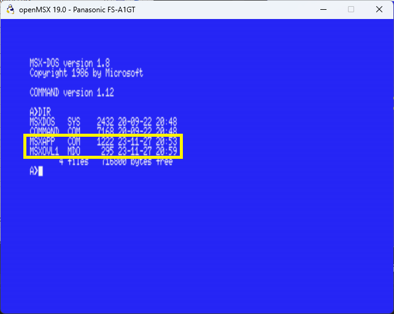
1. Execute your program by typing "**MSXAPP \<ENTER\>**":

	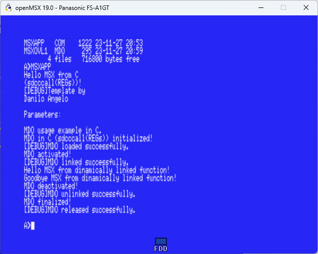
1. The MSX-DOS template parses command line parameters, controlled by the **MAX_CMDLINE_PARAMETERS** setting in
**ApplicationSettings.txt** (0 disables parsing; N reserves space for up to N parameters, N up to 63; default: 10).
Let's experiment with it. Type "**MSXAPP \<PARAMETERS\> \<ENTER\>**":

	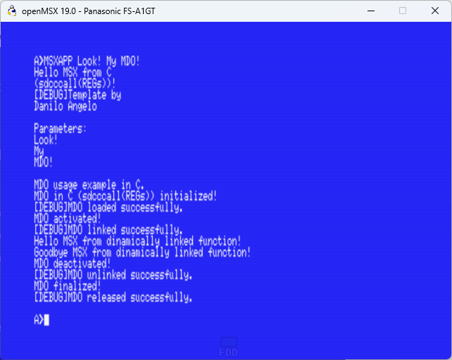
1. Congrats for succeeding running your MDO-enabled MSX-DOS program! Have one more beer!

---

## Understanding the templates' files

Every template follows the same project layout: your sources live at the project root (and under `MSX\...` for the
platform-specific runtime files), and every aspect of the build is driven by plain-text configuration files under the
**Config** folder. Nothing is hidden in the `.vcxproj`/solution files - Visual Studio just shells out to
`python Make\make.py $(Configuration)`, so everything described below applies equally whether you build from Visual
Studio or from the command line.

### Config files common to all templates

#### ApplicationSettings.txt
General, profile-independent project configuration: which crt0 features get compiled in, the C calling convention,
and (where applicable) code/data segment placement and heap size. The exact set of settings depends on the project
type (BIN/ROM/DOS/MDO); see the per-template sections below.

Settings shared by every template:

| Setting | Meaning |
|---|---|
| `PROJECT_TYPE` | `BIN`, `ROM`, `DOS` or `MDO`. Set by the template; don't change it. |
| `GLOBALS_INITIALIZER` | `_ON`: include the routine that copies initialized globals from ROM/ ` _INITIALIZER` into RAM at startup (`gsinit`). `_OFF`: omit it (only safe if you have no initialized globals). |
| `VDP_PORT_FIX` | `_ON`: include the routine (fed by `vdpportmacros.s`) that fixes up VDP port addresses for MA-like secondary-VDP devices (e.g. Neos' MA-20) at startup. `_OFF`: omit it. |
| `ZOO_SUPPORT` / `ZOO_REFLECTION_LEVEL` / `ZOO_REGENERATE_TREE` | See [The ZOO object-orientation framework](#the-zoo-object-orientation-framework) below. |
| `SDCCCALL` | `1`: new SDCC calling convention (parameters in registers, `sdcccall(1)`, smaller/faster). `0`: old convention (parameters on the stack, `sdcccall(0)`). For MSX-DOS + MDO pairs, **both projects must use the same value.** |

#### ApplicationSources.txt
Lists every C/ASM source file that is part of your program (crt0 first - never remove that line - then your `main`
source, then any additional files). On a normal build only files that are new or have changed since the last build
are recompiled - each source is skipped when its `.rel` object already exists and is not older than the source.
Pass `all` (`make.py <PROFILE> clean all`) to force every listed file to be recompiled regardless of timestamps.

#### LibrarySources.txt
Like `ApplicationSources.txt`, but for reusable library sources shared across projects. These are now compiled on
every build using the same new-or-changed check as `ApplicationSources.txt`, so an unchanged library source is
linked from its existing `.rel` instead of being recompiled. `all` forces them all to be rebuilt.

#### Libraries.txt
Precompiled `.lib`/`.rel` files to link into the final binary. These are never compiled by the build script, only
linked.

#### IncludeDirectories.txt
Additional directories the build process searches for source files (besides the project root). `MSX\BIOS` is always
listed; uncomment the `[MSX_LIB_PATH]\...` entries if you're using an external library such as fusion-c.

#### BuildEvents.txt
Hooks for running your own scripts around the build: `BUILD_START_ACTION`/`BUILD_END_ACTION` always run;
`BEFORE_COMPILE_ACTION`/`AFTER_COMPILE_ACTION`/`AFTER_BINARY_ACTION` are skipped on a bare `clean` (no `all`).
The command is run from the project directory, so any path in it (a helper script, a sibling project) is
relative to that directory. Write those paths with forward slashes - `python Make/myscript.py [PROFILE]` -
on every OS; the build script normalises them. A path written with backslashes must be double-quoted
(`python "Make\myscript.py"`) or its separators are lost.

#### Symbols.txt
Controls which symbols get exported to the `.sym`/debug output, via Python-style regex matching (one pattern per
line, optionally followed by a substring search/replace pair to rename the exported symbol). Symbol data is now
extracted from SDCC's `.noi` files rather than scraped from the linker `.map`, so exported names are no longer
truncated at 32 characters.

#### TargetConfig_Debug.txt / TargetConfig_Release.txt
Per-profile configuration, split into three sections:
- **`.BUILD`** - `BUILD_DEBUG` (verbosity level of the build script's own console output - see the inline scale in
the file), `ADB_SUPPORT` (see [AlchemiaZ debug symbols](#alchemiaz-debug-symbols-adb_support) below), and
`ASSEMBLER_EXTRA_DIRECTIVES` / `COMPILER_EXTRA_DIRECTIVES` / `LINKER_EXTRA_DIRECTIVES` / `EXECGEN_EXTRA_DIRECTIVES`
to pass extra flags straight through to `sdasz80`, `sdcc` and `hex2bin`.
- **`.APPLICATION`** - macros/constants available to your own code, most notably `DEBUG` (drives the `dbg`
print macro, so debug-only messages disappear from Release builds) and, for DOS/MDO projects, `MSXDOSPRINT`
(enables pipe/redirection-aware output).
- **`.FILESYSTEM`** - output file naming/location (`MSX_FILE_NAME`, `MSX_FILE_EXTENSION`, `MSX_BIN_PATH`,
`MSX_OBJ_PATH`), and `MSX_DEV_PATH`/`MSX_LIB_PATH`/`ZOO_PATH` (the last one required only when `ZOO_SUPPORT` is
`_ON`; see below).

### The ZOO object-orientation framework
Setting `ZOO_SUPPORT` to `_ON` in `ApplicationSettings.txt` integrates the ZOO object-orientation
framework for Z80 into your build (not yet publicly released - a checkout is required, referenced via `ZOO_PATH`):
any `.zml` class-definition sources found among your project's sources are fed to
`zoo.py` to generate the corresponding C/ASM classes, then the generated engine library is linked in automatically.
You must:
- point `ZOO_PATH` (in `TargetConfig_Debug.txt`/`TargetConfig_Release.txt`) at your local ZOO checkout; and
- choose a `ZOO_REFLECTION_LEVEL`, i.e. how much runtime type information the generated classes carry, trading
memory/speed for reflection capability. From lightest to heaviest: `inheritance`, `polymorphism` (the default),
`classStructure`, `namedInheritance`, `namedMembers`, `typedMembers`.

**`ZOO_REGENERATE_TREE`** controls whether a project generates the full ancestor chain of its `.zml` classes
locally, or borrows those ancestors from an upstream module. By default `zoo.py` is run with `-t`: every class's
`<parent>` chain is regenerated and compiled into *this* project. For a base application that is correct. For an
MDO that subclasses a class already resident (with its engine tables) in the `.COM` it loads into, it means the
MDO carries a second copy of that ancestor - wasted space, and it defeats sharing one class hierarchy across
modules. Set this to let the ancestors resolve at link from the parent's exported symbols instead (the ZOO-class
counterpart of what an extra `parentinterface.s` does for hand-written symbols):

| Value | Effect |
|---|---|
| `_ON` | Always pass `-t`. Regenerate the whole ancestor tree here. Use for a base app, or a standalone ZOO-enabled MDO with no ZOO-enabled parent. |
| `_OFF` | Never pass `-t`. Ancestors reached only through `<parent>` are emitted as geometry only and must resolve at link from an upstream module. |
| `_AUTO` | `-t` **unless** this project's `PROJECT_TYPE` is `MDO` **and** its direct parent (`MDO_PARENT_PROJECT_PATH` in `MDOSettings.txt`) itself has `ZOO_SUPPORT _ON`. Only the immediate parent is consulted - a grandparent's ZOO support does not count. |

Unset behaves as `_ON` for non-MDO projects and `_AUTO` for MDO projects (so the shipped MDO template defaults to
`_AUTO`, the others to `_ON`). If `_AUTO` cannot read the parent's `ApplicationSettings.txt` it falls back to `-t`
on: an over-regenerated MDO is merely fat, a wrongly-skipped one fails to link (or links against a stale symbol).

> `_OFF` (and `_AUTO` when it resolves to off) needs a ZOO checkout new enough to emit the `.include` directives
> for an inherited class's ancestor interface files; older `zoo.py` builds emit the inherited-method aliases but
> not the includes, so the assembly step fails with undefined symbols. Keep `_ON` if in doubt.

### AlchemiaZ debug symbols (ADB_SUPPORT)
Setting `ADB_SUPPORT` to `_ON` in a `TargetConfig_*.txt` file makes the build also emit a `.adb` source-level debug
symbol file (via `adbgenerator.py`) alongside your binary, for use with the AlchemiaZ debugger (not yet publicly
released). It's independent per profile, so you can enable it for Debug while leaving Release lean.

### MSX BIN Application specific settings
- `PUBLISH_FILESTART`: `_ON` registers your program's start address at `HIMEM-1`, so a BASIC loader can locate it
(see the worked example inside `ApplicationSettings.txt` for reading it back with `PEEK`/`DEFUSR`). `_OFF` skips this.
- `FILESTART`: the load address for your `.BIN` file.
- The `SYMBOL`/`SYMBOL/ADDRESS` table lets you publish an index of routine addresses (for `USR`/`USR0`-`USR9`) right
after `FILESTART`, so BASIC can `DEFUSR` into your code without knowing exact addresses ahead of time.

### MSX ROM Application specific settings
- `RETURN_TO_BASIC` / `STACK_HIMEM`: control what happens when `main` returns (back to BASIC, or reboot), and
whether the stack is relocated to `HIMEM` (mutually exclusive with `RETURN_TO_BASIC`).
- `SET_PAGE_2`: maps page 2 to the same slot/subslot as page 1 - useful for 32KB ROMs that occupy pages 1 and 2.
- `LATE_EXECUTION`: defers your program's execution until after other carts have initialized (hooks `H.STKE`),
which among other things is what makes disk access from ROM code (see `diskaccess.s`) actually work.
- `ROM_SIZE` / `FILESTART` / `BASIC_PROGRAM`: ROM size (`16k`/`32k`), load address, and an optional embedded BASIC
program address.
- `CALL_EXPANSION` / `CALL_STATEMENT` and `DEVICE_EXPANSION` / `DEVICE`: extend BASIC's `CALL` command and/or add a
new BASIC device, backed by your own routines.

### MSX-DOS Application specific settings
- `MAX_CMDLINE_PARAMETERS`: `0` disables command-line parsing entirely (no `CMD_TABLE` is even allocated); any value
`N` from 1 to 63 parses up to `N` space-separated parameters from the MSX-DOS command tail, with storage for the
parameter-pointer table sized to *exactly* `2*N` bytes - so pick the smallest `N` that comfortably covers your needs.
The 63 ceiling reflects MSX-DOS's 127-byte command tail, which can't realistically hold more parameters than that.
Default: 10.
- `MDO_SUPPORT`: `_ON` compiles in support for loading MSX-DOS Overlay (MDO) child modules; see
[Running your MSX-DOS program with overlays](#running-your-msx-dos-program-with-overlays-in-webmsx) and
`MDOSettings.txt` below.

### MSX-DOS Overlay (MDO) specific settings and MDOSettings.txt
An MDO project always has `PROJECT_TYPE MDO` and `MDO_SUPPORT _ON` (don't change either). Its `MDOSettings.txt`
describes the project's place in the MDO hierarchy and, for the base application module, the children it loads:

| Setting | Meaning |
|---|---|
| `MDO_APPLICATION_PROJECT_PATH` | Path to the base MSX-DOS application project (the root of the MDO tree). `.` for the application project itself. |
| `MDO_PARENT_PROJECT_PATH` | Path to this MDO's direct parent project (MDO-only). |
| `MDO_PREVIOUS_PROJECT_PATH` | Optional. Path to another already-loaded module (not necessarily the parent) that this MDO should load immediately after - see `FILESTART` below. |
| `FILESTART` | Where this module's code is loaded: `PARENT_AFTERHEAP` (default - right after the parent's memory usage ends), `PREVIOUS_AFTERHEAP` (right after `MDO_PREVIOUS_PROJECT_PATH`'s module instead), or a literal address. |
| `MDO_NAME` | This module's registered MDO name. |
| `MDO_HOOK` | (Application project) Declares a hook signature that child MDOs may implement. |
| `MDO_HOOK_IMPLEMENTATION` | (Child MDO) Binds one of the parent's declared hooks to a local function. |
| `MDO_CHILD` | (Application project) Registers a child MDO's name/filename/extension so the application can load it. |

Each MDO's load address is self-describing (embedded in its own header), which is what makes `PARENT_AFTERHEAP` and
`PREVIOUS_AFTERHEAP` possible: a module doesn't need to be told a fixed address, it snaps to wherever the module it
depends on actually ended up after that module's own build.

### Advanced: crt0 memory layout and the `_POSTHEAP` area
*(Applies to the MSX-DOS Application and MSX-DOS Overlay templates.)*

`msxdoscrt0.s`/`msxdosovlcrt0.s` place all **one-shot startup code** - the VDP port fix, the `gsinit` globals-copy
loop, and (COM only) command-line parameter parsing - in a dedicated `_POSTHEAP` memory area, positioned *after*
`_AFTERHEAP` in the segment order. `_AFTERHEAP` is a zero-length linker marker that other code relies on to know
where "the program's permanent footprint" ends (for example, an MDO computing where to load via `PARENT_AFTERHEAP`,
or your own program managing memory above itself). Because `_POSTHEAP` is placed *after* that marker, its size never
counts toward `_AFTERHEAP`'s resolved address - so once that startup code has run (which happens once, before
`_main`/`_initialize` is ever reached), its memory is fair game to be reclaimed and reused by an MDO or by your own
heap/memory-management scheme.

This is safe *only* for code that (a) runs to completion exactly once, and is never called or jumped to again, before
anything starts reusing that memory (an MDO loading via `PARENT_AFTERHEAP`, or your own scheme growing the heap past
its reserved space), and (b) leaves nothing behind relying on that memory still holding what was put there - no
return address, no stored pointer, nothing later in the program referencing that territory. Live data that must
survive for your program's whole lifetime - such as the command-line parameter table, `CMD_TABLE` - stays in the
ordinary `_DATA` area instead, sized to exactly `2*MAX_CMDLINE_PARAMETERS` bytes.

The net effect is a smaller permanent footprint: on a representative build, `_AFTERHEAP` moved roughly 100-120 bytes
lower than before this reorganization, all of it now available to MDOs or your own heap.

**You can use `_POSTHEAP` for your own code too.** If your program has one-time initialization of its own, place it
in the `_POSTHEAP` area (`.area _POSTHEAP` in your ASM source) the same way crt0 does for its own startup routines,
and call it once. The simplest way to guarantee the two rules above hold: call it as the very first thing your
program does - before any heap allocation and before loading any MDO - so there's no way for anything to touch that
memory ahead of it. It doesn't strictly have to run before `_main`/`_initialize` is entered (crt0's own `_POSTHEAP`
code does, but that's incidental to *how* crt0 is wired, not a requirement of the technique itself) - what matters is
the order of events, not whether `_main` has technically started. Calling it as literally the first statement in
`main()` is safe and is the easiest rule to follow correctly. Either way, it costs you nothing in `_AFTERHEAP`: the
more start-up logic you move there, the lower `_AFTERHEAP` ends up, and the more memory is left over for MDOs or your
own dynamic allocation.

**Using this from C:** the placement is an assembler-level concept (`.area _POSTHEAP`), so plain C code has no direct
way to request it. The approach already used throughout these templates for C/ASM bridging (e.g. `vdpPortFix`,
`print`) is the reliable option: write your one-shot routine in a small `.s` file under `.area _POSTHEAP`, `.globl`
it, and call it from C as an ordinary `extern` function - `extern void myInit(void); myInit();` as the first line of
`main()`. SDCC's `#pragma codeseg <name>` may let you redirect a plain C function's generated code into a named area
directly, avoiding the ASM shim, but that hasn't been verified against this project's toolchain - test it before
relying on it.

**Note:** `_POSTHEAP` is currently only wired up in the MSX-DOS Application and MSX-DOS Overlay crt0 files.
`msxbincrt0.s` still runs its `gsinit`/VDP-port-fix startup code ahead of `_HEAP`, so the same technique isn't
available there yet (tracked as
[issue #80](https://github.com/DamnedAngel/MSX-Templates-for-VisualStudio/issues/80)). ROM projects can't benefit
from it at all: ROM code executes in place from the cartridge instead of being loaded into RAM, so relocating
startup code within `msxromcrt0.s` wouldn't free any RAM or shrink the `.ROM` file.
