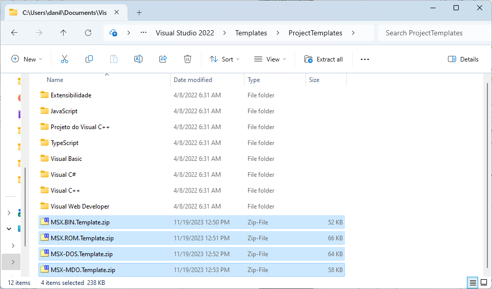

# MSX-Templates-for-VisualStudio
## MSX Application Template Pack for MS Visual Studio (and other environments)

### Version 00.06.00 - Codename Sam

Nov 19th, 2023 
Damned Angel / 2020-2023

---

## Table of contents

1. [Introduction](#introduction)
1. [To Caesar what is Caesar's - My note of acknowledgement and thanks](#to-caesar-what-is-caesars)
1. [Where to get the templates](#where-to-get-the-templates)
1. [I don’t like/have/care for/use MS Visual Studio](#i-dont-likehavecare-foruse-ms-visual-studio)
1. [Getting started - quick and dirty](#getting-started-quick-and-dirty)
	1. [Setting up the environment](#setting-up-the-environment)
	1. [Creating your MSX Application in Visual Studio](#creating-your-msx-application-in-visual-studio)
	1. [Building (compiling/assembling) your MSX Application in Visual Studio](#building-compilingassembling-your-msx-application-in-visual-studio)
	1. Running your MSX BIN Application
		1. Example 1: Running your program in WebMSX
		1. Example 2: Running your program in OpenMSX (with Catapult)
	1. Running your MSX ROM Application
		1. Example 1: Running your program in WebMSX
		1. Example 2: Running your program in OpenMSX (with Catapult)
	1. Running your MSX-DOS Application
		1. Example 1: Running your program in WebMSX
		1. Example 2: Running your program in OpenMSX (with Catapult)

---

## Introduction

This asset is intended to document information about Damned Angel’s MSX Templates for MS Visual Studio (and other environments).

4 templates are available:
- **MSX BIN applications** (BLOADable binary) ;
- **MSX ROM applications**;
- **MSX-DOS applications**; and
- **MSX-DOS application Overlays** (MDOs).

Each of the templates above has 2 variants:
- The Visual Studio one (\*.Template.zip), which allows VS to instantiate a project with build commands already configured;
- The generic one (\*.Application.zip), which is a raw functional project, to be unzipped and edited with your favorite IDE. Build commands must be issued in command-line (Windows, Linux and MacOS), or configured manually in your IDE.

**MSX-wise, the variants are equal and provide the same functionality.**

---

## To Caesar what is Caesar's
### Or: My note of acknowledgement and thanks

All the work I have been putting into the construction of the templates have been HEAVILY and COMPLETELY influenced by [Konamiman](https://www.konamiman.com/msx/msx-e.html)'s work on [SDCC libraries](https://www.konamiman.com/msx/msx-e.html#sdcc) and by [Avelino Herrera](http://avelinoherrera.com/blog/)’s [SDCC backend for MSXDOS](http://msx.avelinoherrera.com/index_en.html#sdccmsxdos) and SDCC [backend for MSX ROMs](http://msx.avelinoherrera.com/index_en.html#sdccmsx).

Without their work, the MSX VS templates and makefiles I developed would not be there.

Masters, thank you very much for pioneering and publishing the content on MSX file formats generation.

In the current version of the templates, the build script has been unified in a single python file, supporting Windows, Linux and MacOS. Originally, however, there was a BAT script for Windows and a port for bash (Linux and MacOS) by [Pedro de Medeiros](https://github.com/pvmm).

Pedro, you have my eternal gratitude for your interest, ideas, patience and willful caring for the build script.

Additionally, I want to thank everbody on the WhatsApp **"MSX Pascal, C, ASM etc."** group, which are too many to cite individually, but who helped a lot analyzing bugs and finding solutions. Thank you all!

---

## Where to get the templates

Please access the project's [Github](https://github.com/DamnedAngel/MSX-Templates-for-VisualStudio/releases) to get the latest version of the templates.

After reading the release notes, go down to the Asset section of the page and you will find the templates and their variants. 

---

## I don’t like/have/care for/use MS Visual Studio

If you don’t use MS VIsual Studio but still want to use the MSX project templates, you are lucky.

Although the templates are conceptualized and developed inside Microsoft Visual Studio, their bindings to this environment are fairly loose. Surely, the VS-Specific templates (\*.Template.zip) include specific files that define Visual Studio solutions and projects, but one can thoroughly disregard them and still take advantage of the project structure and build script, along with his/her preferred IDE/Editors. In fact, a raw version of the templates (\*.Application.zip) is readily provided for your convenience.

To use the templates outside Visual Studio (Windows, Linux, MacOS):
1. Make sure to have Python, SDCC and Hex2Bin installed in the path of your OS.
1. Download the raw template (\*.Application.zip) and unzip it in an appropriate folder in you computer;
1. Take advantage of the project structure;
1. Use the configuration files as described in this manual;
1. Build your project, either through your IDE commands or manually, with:
	1. Go to your project’s folder with “cd” command;
	1. Windows (replace \<PROFILE\> with “Debug” or “Release” (case sensitive)):
	
			Build:			python .\Make\make.bat <PROFILE>
			Rebuild All: 		python .\Make\make.bat <PROFILE> clean all
			Clean:			python .\Make\make.bat <PROFILE> clean
1. Have FUN!

---

## Getting started - quick and dirty

### Setting up the environment

1. Download and install your preferred IDE/Code editor.
	1. In case you wish to use MS Visual Studio, download it from https://visualstudio.microsoft.com/downloads/. The free "Community" version is good enough. **Be sure to install some workload, preferably the support for C++ and/or C++ games. Such extensions are NOT used for building the MSX programs, but they seem to be necessary in order for VS to recognize the MSX project templates.**
1. Download and install the latest version of SDCC from http://sdcc.sourceforge.net/.
	1. You may need to recompile from the source if the binary distribution for your OS is not available. It is a straightforward process, though.
	1. Make sure you have sdcc.exe and sdasz80.exe (comes with SDCC) in your OS’s path variable (open a command prompt/terminal/shell and type **sdcc \<enter\>** and **sdasz80 \<enter\>** and be sure the programs are executed).
1. Download and install Hex2Bin from http://hex2bin.sourceforge.net/.
	1. Again, you may need to recompile from the source if the binary distribution for your OS is not available. It is also a very straightforward process.
	1. Make sure you have hex2bin.exe in your Windows path variable (open a prompt/terminal/shell and type **hex2bin \<enter\>** and be sure the programs are executed).
1. Install Python from https://www.python.org/.
1. Download the MSX Application Templates for MS Visual Studio from the project's [Github](https://github.com/DamnedAngel/MSX-Templates-for-VisualStudio/releases).
	1. If you are using the templates for MS Visual Studio:
		1. Open Windows Explorer and go to **C:\\Users\\[User Name]\\Documents\\Visual Studio [Version]\\Templates\ProjectTemplates\\** (create the folders, if needed).
		1. Copy/Move the MSX Application Templates zip files to this folder:
	
		1. That should be all. In some installations, however, VS is stubborn to recognize the templates. If you encounter such a problem, things you may try:
			1. Create a new folder under “ProjectTemplates” and name it "MSX". Put the templates there.
			1. Unzip the templates, each in their own separate folder.
			1. If you installed VS without any workload (Language support), try to install C/C++ workloads
1. Have a beer.

### Creating your MSX application in Visual Studio

1. After installing the templates, fire MS Visual Studio up.
1. Create you MSX project:
	1. Click the **Create a new project** button: 
	
	1. Locate the MSX templates on the template list. Sometimes their are shown in the bottom of the list, so you may have to scroll down:
	
	1. Choose the template you want and click **Next**.
	1. Fill in the name of your solution and project and set your preferred location for the project files:
	
	**Notes:**
		1. At this point, VS will double your project name as the Solution Name. If you don’t intend to have multiple projects inside the solution, leave it that way.
		1. Leave the **Place solution and project in the same directory** checkbox unmarked.
	1. Click the **Create** button.
	1. Sit and relax. When the fairies of the 8-bit realms complete their job, you should see the lovable Visual Studio Project Screen, inviting you to rock and roll:
	
1. Congrats! You have an MSX Application project. Have another beer.

### Building (compiling/assembling) your MSX application in Visual Studio

1. Select the configuration you want to use for the compiling/assembling:
	
	**Note:** Later in this document we will (eventually) discuss what this option is for. For the moment, choose whatever you like, there will be no difference.
1. Select **Build | Build Solution** menu option:
	
1. Visual Studio will run the make script. When it ends, you should see the results of the build process and the messages of success in the bottom **Output** panel:
	
1. Inspect your generated binary file:
	1. Open Windows Explorer and navigate to the directory holding your solution (the folder you defined in step 2.iv of “Creating your MSX Application in Visual Studio” section above.
	1. Access your solution’s folder.
	1. Access your project’s folder.
	1. Access the directory of your chosen build configuration (Debug/Release - see step 1 above).
	1. Access the "bin" folder. Your program should be there (the extension of the file may vary according to the type of project you chose):
	
1. Yey! You successfully built your MSX application! Have one more beer!

### Running your MSX applications on emulators

**Note:** The processes below suppose you have the emulators and its tools configured. If you don't, you will probably still be able to use [WebMSX](https://webmsx.org/), which operation is very straight forward.

1. **Example 1:** Running your BIN program in WebMSX:
	1. Fire WebMSX up and select **Drive A | Import Files to Disk** menu option:
	
	1. Select your program in the **Open File dialog** and click **Open**:
	
	1. In MSX-BASIC, type the command **FILES \<ENTER\>** to confirm that your program was added to the disk image:
	
	1. Now… the time of truth! The moment we all have been waiting for… Type **BLOAD “MSXAPP.BIN”, R \<ENTER\>**
and you should see you program blissfully running:
	
	1. Yey! You successfully executed your MSX BIN application! Have one more beer!
2. **Example 2:** Running your BIN program in OpenMSX (with Catapult):
	1. Fire OpenMSX's Catapult up, start the emulation and, in the **Session tab**, click on **Disk A** and select **Browse for disk folder (DirAsDisk)** on the drop down menu:
	
	1. Select your program’s folder in the Browse for Folder dialog and click on the **Select Folder** button:
	
	1. In MSX-BASIC, type the command **FILES \<ENTER\>** to confirm that your program was added to the disk image:
	
	1. Now… the time of truth! The moment we all have been waiting for… Type **BLOAD “\<FLOPPY DRIVE\>:MSXAPP.BIN”, R \<ENTER\>**
and you should see you program blissfully running:
	
	1. Yey! You successfully executed your MSX BIN application! Have one more beer!
2. **Example 3:** Running your ROM program in WebMSX:
	1. Fire WebMSX up, drag the ROM file from your filesystem explorer and drop it on WebMSX's **Cartridge 1** panel:
	
	1. During the boot process, you will see a (very fast) flash with the messages from the cartridge (don't worry they are repeated. That is an effect of the ROM mirroring feature of the emulator):
	
	**NOTE:** the messages are shown for just a brief moment because the example program just shows the messages and quits. Your program may (and probably will) have a different behavior.
	1. Since the example program in its original settings implements extensions to the CALL command in basic, you can also test this feature after the boot, typing **CALL CMD1 ("Message") \<ENTER\>** and **CALL RUNCART \<ENTER\>**:
	
